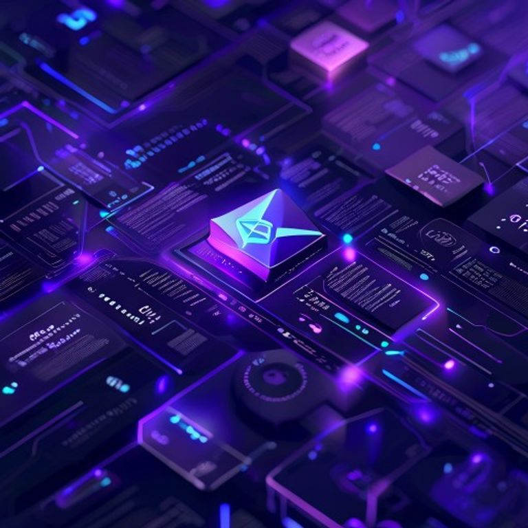
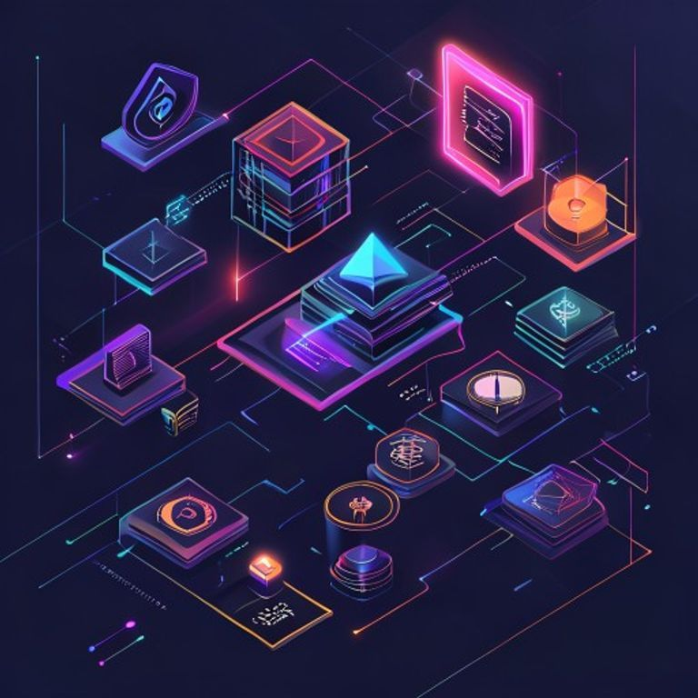

<p align="center">
  
</p>

<h1 align="center">🔒 <em>Bakome Escrow</em></h1>

<p align="center">
  <strong>Secure Payment Smart Contract on Solana</strong>
</p>

<p align="center">
  <a href="#english">🇬🇧 English</a> •
  <a href="#français">🇫🇷 Français</a> •
  <a href="#español">🇪🇸 Español</a> •
  <a href="#中文">🇨🇳 中文</a>
</p>

<p align="center">
  <a href="LICENSE"></a>
  <a href="#"></a>
  <a href="#"></a>
  <a href="#"></a>
</p>

---

<a name="english"></a>
## 🇬🇧 English

### 🎯 Why?

Freelance platforms charge high fees and impose geographic restrictions. **Bakome Escrow** removes these barriers with a decentralized smart contract on Solana.

> No middleman. No hidden fees. 100% transparent.

<p align="center">
  
</p>

| Step | Action |
|------|--------|
| 🔒 Deposit | Client locks USDC into the smart contract |
| 💻 Work | Developer completes the task |
| ✅ Payment | Contract automatically releases funds |
| ↩️ Refund | Possible if conditions are not met |

---

<a name="français"></a>
## 🇫🇷 Français

### 🎯 Pourquoi ?

Les plateformes freelance imposent des frais élevés et des restrictions géographiques. **Bakome Escrow** élimine ces barrières avec un contrat intelligent décentralisé sur Solana.

> Aucun intermédiaire. Aucun frais caché. 100% transparent.

| Étape | Action |
|-------|--------|
| 🔒 Dépôt | Le client verrouille des USDC dans le contrat |
| 💻 Travail | Le développeur accomplit la mission |
| ✅ Paiement | Le contrat libère automatiquement les fonds |
| ↩️ Remboursement | Possible si les conditions ne sont pas remplies |

---
<a name="español"></a>
## 🇪🇸 Español

### 🎯 ¿Por qué?

Las plataformas freelance imponen comisiones altas y restricciones geográficas. **Bakome Escrow** elimina estas barreras con un contrato inteligente descentralizado en Solana.

> Sin intermediarios. Sin comisiones ocultas. 100% transparente.

| Paso | Acción |
|------|--------|
| 🔒 Depósito | El cliente bloquea USDC en el contrato |
| 💻 Trabajo | El desarrollador completa la tarea |
| ✅ Pago | El contrato libera los fondos automáticamente |
| ↩️ Reembolso | Posible si no se cumplen las condiciones |


---
<a name="中文"></a>
## 🇨🇳 中文

### 🎯 为什么？

自由职业平台收取高额费用并施加地域限制。**Bakome Escrow** 通过 Solana 上的去中心化智能合约消除了这些障碍。

> 无中间人。无隐藏费用。100% 透明。

| 步骤 | 操作 |
|------|------|
| 🔒 存款 | 客户将 USDC 锁定在智能合约中 |
| 💻 工作 | 开发者完成任务 |
| ✅ 付款 | 合约自动释放资金 |
| ↩️ 退款 | 如条件未满足，可退款 |

---

## 🏗️ Architecture

```
Client ──USDC──> [BAKOME ESCROW] ──USDC──> Developer
(on-chain)
```
---

## 🛠️ Tech Stack

| Technology | Role |
|------------|------|
| Rust 🦀 | Smart contract language |
| Anchor ⚓ | Solana framework |
| Solana ☀️ | High-performance blockchain |
| USDC 💵 | Stablecoin for payments |

---

## 📝 License

MIT License — Free to use for everyone.

---

<p align="center">
  
</p>

<p align="center">
  <sub>Built with 🦀 on ☀️ Solana</sub>
</p>

---

## 🔗 Deployment

**Devnet Program ID:** [`FXkCNZaDgZ72vn51jek4jxo9VAFDU72XR2VZvGf4Mv8B`](https://explorer.solana.com/address/FXkCNZaDgZ72vn51jek4jxo9VAFDU72XR2VZvGf4Mv8B?cluster=devnet)

✅ Deployed on Solana Devnet — July 8, 2026

## 💼 Hire Me
- **Upwork**: https://www.upwork.com/freelancers/~01b0b420668352df97
- **Smart Contracts**: Solana Devnet - `FXkCNZaDgZ72vn51jek4jxo9VAFDU72XR2VZvGf4Mv8B`
- **Open Source**: 89+ projects on GitHub

## ☕ Support My Work
[](https://buymeacoffee.com/bakomebandh)
[](https://ko-fi.com/merryglenns5i222l0ik)

---

## 🎥 Demo Video

[](assets/demo.mp4)

▶️ Click to watch the full demo
